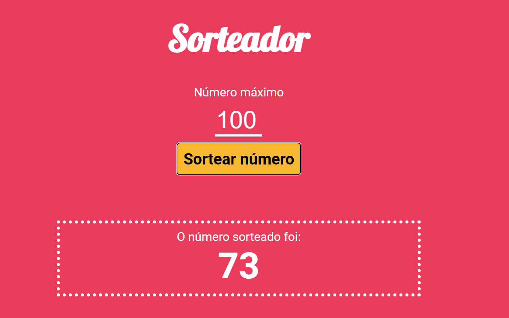

<h1 align="center"> Sorteador de Números </h1>

 

  

## 🚀 Tecnologias

Esse projeto foi desenvolvido com as seguintes tecnologias:

- HTML
- CSS
- Less
- Javascript
- npm
- Grunt
- Git e Github

## 💻 Projeto

Este projeto foi feito durante as aulas do curso de Python FullStack da [EBAC](https://ebaconline.com.br/)

- [Visite o projeto online](https://sorteador-grunt-peach.vercel.app/)